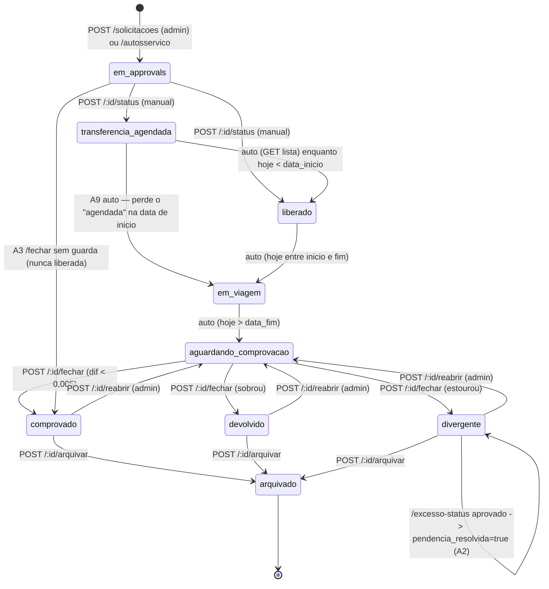

# AUDITORIA — ProAgro ERP Financeiro
**Data:** 29/07/2026 · **Modo:** somente leitura (nenhum dado, arquivo de código ou deploy foi alterado)
**Escopo:** `api/index.js` (2.107 linhas, 93 rotas), `public/app.js` (5.639 linhas), `public/styles.css`, `public/index.html`, `supabase/schema.sql`, `package.json`, `vercel.json`, banco de **produção** (Supabase `wsieuqzrztlgxwotrjpy`, região `us-east-1`), histórico git (200 commits).
**Datasets estáticos** (`br-localidades.js`, `br-aviacao.js`): auditado apenas o consumo, conforme instrução.

> ## 🛠 Status da correção — atualizado em 30/07/2026
> **Fase 0 executada e verificada:**
> - ✅ **C1 fechado** — RLS ligado nas 9 tabelas + `REVOKE` de `anon`/`authenticated` (migração `seguranca_rls_todas_tabelas_erp_e_revoke_anon`). Verificado: as 9 tabelas agora devolvem `HTTP 401 permission denied` para a chave anon (antes: `200` com dados, incluindo `password_hash`); o backend segue operando (12 tabelas lidas + escrita OK, pois conecta como `postgres` com `rolbypassrls=true`); os 9 erros `rls_disabled_in_public` desapareceram do linter Supabase.
> - ✅ **C2 fechado** — novo `anexoViaticoNoEscopo()` aplicado nas 5 rotas de anexo; a contagem também passou a respeitar o escopo.
> - ✅ **C4 fechado** — whitelist de MIME + verificação por assinatura do conteúdo no upload; `previewable` no front virou lista explícita (SVG nunca é renderizado). Verificado: SVG declarado → 415, **SVG renomeado para .png → 415**, PDF/PNG legítimos → 200.
> - ✅ **A4 contido** — endpoints de autosserviço passaram a exigir `requireAutosservico`: liberados só para o super-admin (que valida a tela) ou com `AUTOSSERVICO_VIATICOS=on`. O recálculo server-side da previsão segue pendente (Fase 1).
> - ⏳ **A1 aguarda decisão de negócio** (base de hospedagem: noites × dias).
>
> Pendência de infraestrutura para o dono do sistema: **rotacionar a chave anon legada** no painel do Supabase (defesa extra; a chave não está no repositório) e **confirmar a janela de backup**.

**Convenção de evidência**
- ✅ **VERIFICADO** — reproduzido/medido neste ambiente, com saída registrada
- 📖 **CÓDIGO** — inequívoco na leitura, não executado (execução exigiria escrita, proibida nesta rodada)
- ❓ **HIPÓTESE** — não foi possível confirmar; listado também em *Pontos não verificados*

---

## 1. Sumário executivo

O ERP está funcional e a modelagem financeira é melhor do que a média (todo dinheiro em `numeric(14,2)`, zero registros órfãos em 6 checagens, saldo da Carteira Flash calculado e conferido). O problema não está no que o sistema faz, e sim no **perímetro**: a base de produção está acessível fora do backend, e duas regras de viáticos se contradizem entre a previsão e a conferência. A camada de permissão do Express é sólida (94 rotas mapeadas, escrita sempre atrás de `requireEdit`), mas ela **não é a única porta do banco** — e é isso que rebaixa a nota de segurança.

| Eixo | Nota | Justificativa objetiva |
|---|---|---|
| Funcional | **7,0** | Fluxos operam; há contradição de regra hospedagem (noites × dias) e aprovação de excesso que resolve pendência indevida |
| Segurança | **2,5** | 8 tabelas de produção legíveis com a chave anon (inclui `password_hash`); anexos sem escopo; XSS armazenado via SVG; zero headers |
| Integridade de dados | **5,0** | Nenhuma transação no projeto; race condition em estoque; parsers de dinheiro frouxos — porém tipos corretos e 0 órfãos |
| Performance | **6,0** | Sem paginação nas 4 listagens principais; N+1 na exportação detalhada; ~20 queries em série no dashboard |
| Manutenibilidade | **4,0** | Monolito de 5.639 linhas; a mesma regra em 3 cópias; zero testes, lint e CI; deploy direto em produção |

**Os 5 riscos a resolver nesta semana**
1. **C1** — RLS desabilitado em 8 tabelas + GRANT total para `anon`: toda a base financeira e os hashes de senha são legíveis (e graváveis) fora do ERP. ✅
2. **C2** — Anexos de viáticos sem filtro de escopo: comprovantes de qualquer colaborador baixáveis trocando o id. 📖
3. **A1** — Hospedagem prevista por **noites** e conferida por **dias**: permite comprovar ~2× o previsto sem gerar excesso. ✅
4. **A2** — Aprovar *um* excesso marca a pendência inteira como resolvida (e aceita chave inventada). 📖
5. **C4** — XSS armazenado: anexo `image/svg+xml` é renderizado em `iframe` sob a origem do ERP. 📖

---

## 2. Placar de achados

| Severidade | Qtd | ✅ Verificado | 📖 Código | ❓ Hipótese |
|---|---|---|---|---|
| 🔴 Crítico | 4 | 1 | 3 | 0 |
| 🟠 Alto | 10 | 5 | 5 | 0 |
| 🟡 Médio | 15 | 8 | 7 | 0 |
| 🔵 Baixo | 10 | 7 | 3 | 0 |
| **Total** | **39** | **21** | **18** | **0** |

Achados por módulo: Infra/Banco 9 · Viáticos 12 · Anexos 4 · Autosserviço 3 · Suprimentos 3 · Orçamento 3 · Integrações 3 · Financeiro (Pagar/Receber/Conciliação) 2 · Plataforma/Processo 4 · Frontend transversal 6 *(há sobreposição)*.

---

## 3. Achados críticos

### C1 · Base de produção exposta fora do backend (RLS + GRANTs) — ✅ VERIFICADO
**Módulo:** Infra/Banco · **OWASP:** A01 Broken Access Control · **LGPD:** Art. 46 (segurança), Art. 48 (incidente)

**Evidência 1 — linter oficial do Supabase:** 9 tabelas com `rls_disabled_in_public`, nível **ERROR**:
`erp_users`, `erp_payables`, `erp_receivables`, `erp_bank_transactions`, `erp_suppliers`, `erp_budgets`, `erp_login_attempts`, `erp_estoque_itens`, `erp_estoque_movimentos`.

**Evidência 2 — GRANTs** (`information_schema.role_table_grants`): as roles `anon` e `authenticated` têm `SELECT, INSERT, UPDATE, DELETE, TRUNCATE, REFERENCES, TRIGGER` em **todas** as 19 tabelas `erp_*`.

**Evidência 3 — teste de leitura executado** com a chave anon (`disabled: false`, JWT com validade até 2036), via `https://<ref>.supabase.co/rest/v1/`:

| Tabela | RLS | HTTP | Linhas retornadas |
|---|---|---|---|
| `erp_users` | OFF | 200 | **3** (inclui `password_hash` — `$2a$10$…`) |
| `erp_payables` | OFF | 200 | 3 |
| `erp_receivables` | OFF | 200 | 3 |
| `erp_bank_transactions` | OFF | 200 | 3 |
| `erp_suppliers` | OFF | 200 | 3 (com `pix_key`) |
| `erp_budgets` | OFF | 200 | 3 |
| `erp_estoque_itens` | OFF | 200 | 3 |
| `erp_login_attempts` | OFF | 200 | 2 |
| `erp_colaboradores` / `_solicitacoes` / `_despesas` / `erp_attachments` / `erp_audit_log` | ON | 200 | **0** ← RLS funcionando |

Sem chave: `HTTP 401 {"message":"No API key found in request"}` — ou seja, **não é explorável por um anônimo qualquer da internet**; exige a chave anon.

**Por que ainda é crítico:** a chave anon é *publishable* por design (o Supabase espera que ela seja embutida em clientes), está ativa, tem validade de 10 anos e é obtenível por qualquer pessoa com acesso ao projeto. Enquanto ela existir sem RLS, a camada de permissão do Express (`requireEdit`, `viaticosEscopo`) é contornável por completo: o atacante não passa pelo ERP. Os GRANTs incluem `TRUNCATE` — **não testei escrita** (proibido nesta rodada), mas a permissão está concedida.

**Mitigação atual (parcial):** a chave **não** está no repositório, no `public/` nem no histórico git (verificado; a única ocorrência de padrão de credencial em 200 commits é o placeholder `postgresql://postgres.[ref]:[SUA-SENHA]@…` em `.env.example`, commit `b81fec0`).

**Correção proposta:** `ALTER TABLE … ENABLE ROW LEVEL SECURITY` nas 8 tabelas (sem criar política — nega tudo para anon/authenticated, exatamente como já acontece nas 10 protegidas; o backend usa a connection string direta e não é afetado), `REVOKE ALL … FROM anon, authenticated`, e rotação da chave anon legada.

---

### C2 · Anexos de viáticos ignoram o escopo do colaborador — 📖 CÓDIGO
**Módulo:** Anexos/Viáticos · **OWASP:** A01 · **LGPD:** Art. 6º VII (segurança), dado financeiro de terceiro

`api/index.js:636` (`GET /api/attachments/file/:id`), `api/index.js:646` (`count/:type`) e `api/index.js:660` (`GET /:type/:id`) validam **apenas a permissão de página**:

```js
// api/index.js:641
const page = pageForType(a.entity_type);
if (req.user.role !== 'admin' && !canView(req.user, page)) return res.status(403)…
```

Compare com a rota irmã, que **filtra** por escopo — `api/index.js:1766-1772`:
```js
const escopo = await viaticosEscopo(req.user);
if (escopo) { const dona = await query('SELECT 1 FROM erp_viaticos_solicitacoes WHERE id=$1 AND colaborador_id = ANY($2)', …) }
```

**Impacto:** usuário com `viaticos: view` (na tela vê só as próprias viagens) enumera ids e baixa nota de hotel, passagem e recibo de qualquer colega. `count/viatico` devolve a contagem global.

**Não executei o teste end-to-end:** a única conta com `viaticos: view` (`id=3`) está com `active=false`, e não criei nem reativei conta de produção. Evidência de código é direta.

---

### C3 · Nenhuma transação em todo o projeto — ✅ VERIFICADO
**Módulo:** Infra · **Impacto:** integridade

`grep -nE "BEGIN|COMMIT|ROLLBACK|pool.connect" api/index.js` → **0 resultados**. Operações compostas gravam em queries independentes:

| Operação | Queries | Estado inconsistente possível |
|---|---|---|
| Compra de suprimento (`api/index.js:1979-2011`) | `INSERT erp_payables` → `INSERT movimento` → `UPDATE custo_medio` | título a pagar **sem** entrada de estoque |
| Devolução de envio (`api/index.js:2033-2050`) | `INSERT movimento` → `UPDATE status` | estoque reposto com envio ainda "enviado" |
| Fechar viático (`api/index.js:1723`) | leitura de despesas → `UPDATE` | valores baseados em leitura já defasada |
| Renomear categoria (`api/index.js:757-770`) | 3–4 `UPDATE` em cascata | categoria renomeada e lançamentos com nome antigo |

Em serverless a chance não é teórica: timeout do pooler no meio da sequência já basta.

---

### C4 · XSS armazenado via anexo SVG — 📖 CÓDIGO
**Módulo:** Anexos · **OWASP:** A03 Injection

Cadeia completa:
1. `api/index.js:679` — `const mime = sanitize(req.body.mime_type) || 'application/octet-stream';` → **o MIME vem do cliente, sem whitelist** (`grep` por whitelist de MIME: 0 ocorrências). Só o `kind` é validado (`api/index.js:680`).
2. `public/app.js:5473` — o front envia `mime_type: file.type`, controlável.
3. `public/app.js:5381` — `previewable = mime === 'application/pdf' || mime.startsWith('image/')` → `image/svg+xml` passa.
4. `public/app.js:5383` — `<iframe src="${url}">` com `URL.createObjectURL(blob)`; blob: URL **herda a origem** do documento criador.

**Impacto:** qualquer usuário com permissão de anexar (edit em pagar/receber/viáticos) sobe um SVG com `<script>`; quem visualizar o anexo — tipicamente o super-admin conferindo comprovações — executa o script na origem do ERP. O cookie é `httpOnly` (não é lido por JS), mas o script pode disparar requisições autenticadas à API em nome da vítima (aprovar, alterar, excluir).

**Não explorado:** demandaria upload (escrita).

---

## 4. Achados altos

### A1 · Hospedagem: previsão por NOITES × conferência por DIAS — ✅ VERIFICADO
**Módulo:** Viáticos (TUD) · **Impacto:** financeiro e de compliance

| Camada | Fórmula | Evidência |
|---|---|---|
| Previsão (wizard, etapa 4 e resumo) | `valor_diaria × noites` | `public/app.js:4220`, `public/app.js:4267` |
| Teto na conferência (excesso TUD) | `valor_diaria × dias` | `public/app.js:3118` |

`noites = dias − 1` (`public/app.js:3474`). Viagem de 2 dias, TUD R$ 120/noite:
- previsto/liberado: **R$ 120**
- teto que dispara excesso: **R$ 240**

O colaborador comprova R$ 240 de hospedagem, a solicitação vira `divergente` por caixa (liberado < comprovado) e **nenhum excesso de TUD é apontado** — as duas camadas que o sistema separa (compliance × caixa) discordam por construção. Quanto mais curta a viagem, maior o descolamento (viagem de 1 dia: previsão 0 noites, teto 1 dia).

### A2 · Aprovar um excesso resolve a pendência inteira, e a chave não é validada — 📖 CÓDIGO
`api/index.js:1745-1757`:
```js
const chave = String(req.body.chave || '').trim();      // ← nenhuma validação de domínio
atual[chave] = status;                                   // ← grava qualquer chave no JSONB
if (status === 'aprovado' && s.sol_status === 'divergente') {
  await query(`UPDATE … SET pendencia_resolvida=true WHERE id=$1`, …);   // ← resolve TUDO
}
```
1. Solicitação com 2 excessos: reprovar `hospedagem` e aprovar `alimentacao_2026-08-03` ⇒ `pendencia_resolvida=true` **com um excesso reprovado em aberto**.
2. Chave arbitrária (`{"chave":"x","status":"aprovado"}`) ⇒ mesma coisa, sem que exista excesso algum.
3. Não há reversão: reprovar depois **não** volta `pendencia_resolvida` para `false`.

Dados atuais (44 registros): `excessos_status` é sempre `object`, chaves no formato esperado, todas `"aprovado"` — nenhum lixo hoje, mas o caminho está aberto.

### A3 · `/fechar` sem guarda de status e sem idempotência — 📖 CÓDIGO
`api/index.js:1713-1726` não filtra o status atual (compare com `/arquivar`, `api/index.js:1729`, e `/reabrir`, `api/index.js:1737`, que usam `WHERE … AND status IN (…)`). Consequências: fechar uma solicitação `em_approvals` (nunca liberada) produz `status='comprovado'` com valores zerados; refechar uma já finalizada recalcula e sobrescreve; duplo clique/duas requisições simultâneas não têm trava (o resultado é idempotente no cálculo, mas não há proteção estrutural).

### A4 · Autosserviço já está exposto e o backend confia nos valores do navegador — 📖 CÓDIGO
`api/index.js:1562` — `POST /api/viaticos/solicitacoes/autosservico` protegido **apenas** por `requireAuth` + vínculo a colaborador. A ocultação é só no front (rota por hash `#via-solicitar`, `public/app.js:313-320`, fora de `PAGES`): **segurança por obscuridade confirmada** — a seção "não lançada" é plenamente funcional via API para qualquer usuário logado vinculado a um colaborador, inclusive sem nenhuma permissão de página.

Pior: `previsao_por_categoria` e `transporte_detalhes` são gravados como vieram do cliente (`api/index.js:1577-1585`), **sem recálculo contra a TUD** (`grep` por validação/recálculo de previsão no backend: nenhuma). O único cálculo de `categoria_local` vive no front (`public/app.js:2797`), e o backend apenas verifica se o valor está no enum (`api/index.js:1539`). Um colaborador pode postar `categoria_local: 'sp_df_rj_intl'` com destino no interior e uma previsão inflada — é o que o aprovador vê na tela e no PDF. Mitigação: `valor_liberado` entra `0` (`api/index.js:1580`), então o desembolso ainda depende do admin.

### A5 · `viaNum()` — parser de dinheiro perde 1000× em caso comum — ✅ VERIFICADO
`public/app.js:3648` (usado na diária de aluguel, `public/app.js:4272`):

| Digitado | Resultado | Observação |
|---|---|---|
| `1.500,50` | 1500.5 | ok |
| **`1.500`** | **1.5** | ❌ "mil e quinhentos" vira R$ 1,50 (só remove ponto se houver vírgula) |
| `1,500.50` | 1.5005 | ❌ formato EN |
| `R$ 1.500` | 0 | ❌ silencioso |
| `-50` | -50 | ❌ diária negativa aceita |
| `1500.789` | 1500.789 | 3 decimais → `numeric(14,2)` arredonda: tela ≠ banco |
| `abc`, `1.5.0`, `  ` | 0 | silencioso |

### A6 · `num()` do Orçamento — erro de 100× — ✅ VERIFICADO
`public/app.js:90`, consumido na grade em `public/app.js:2531`. Remove **todos** os pontos: `1234.50` → **123450**. `R$ 100` → 0. Alimenta Orçado × Realizado e os alertas do Dashboard. (Contas a Pagar/Receber usam `input type="number"` e não sofrem — `public/app.js:803`.)

### A7 · Race condition no saldo de estoque — 📖 CÓDIGO
`api/index.js:1865` (`estoqueAtualItem`) lê o saldo; `api/index.js:2013` (envio) e `api/index.js:2052` (ajuste) inserem depois, sem `FOR UPDATE` e sem transação. Duas saídas simultâneas do último item passam ambas. Hoje o saldo está íntegro (0 itens negativos, verificado).

### A8 · `status_manual` é irreversível — 📖 CÓDIGO
`api/index.js:1707` grava sempre `status_manual=true`; não existe rota nem UI que volte para `false`. Qualquer ajuste manual **congela o registro fora da automação para sempre**.

### A9 · "Transferência Agendada" é perdida quando a data de início chega — 📖 CÓDIGO
`api/index.js:1622-1625`: o status só é preservado enquanto `hoje < data_inicio`. A partir da data de início, o `CASE` cai em `em_viagem`/`aguardando_comprovacao` — **mesmo que a transferência nunca tenha sido feita**. O sistema passa a afirmar que a viagem está em curso e financiada.

### A10 · Rotina de status roda dentro de um `GET`, sem escopo e sem cron — 📖 CÓDIGO
`api/index.js:1619-1627`: `UPDATE` disparado por `GET /api/viaticos/solicitacoes`.
- **Efeito colateral de escrita em leitura**: um colaborador com escopo restrito, ao abrir a lista, atualiza o status de **todas** as solicitações da empresa (o `UPDATE` não tem filtro de escopo; o `SELECT` seguinte tem).
- **Sem cron** (Vercel serverless): se ninguém abrir a tela, os status ficam defasados indefinidamente.
- **Concorrência**: dois acessos simultâneos executam o mesmo `UPDATE` (resultado idempotente, mas com contenção de lock).
- Por isso **não chamei essa rota** durante a auditoria.

---

## 5. Achados médios

| # | Achado | Evidência | Ev. |
|---|---|---|---|
| M1 | **Carteira Flash acoplada à string `'Viáticos'`**: renomear a categoria (o rename propaga para `erp_payables`, `api/index.js:757-770`) faz o saldo zerar silenciosamente | `api/index.js:1831-1832` | ✅ |
| M2 | Logout não invalida o JWT (stateless, sem denylist): token capturado vale 8h | `api/index.js:388`, `api/index.js:28` | 📖 |
| M3 | Zero headers de segurança (CSP, X-Frame-Options, X-Content-Type-Options, Referrer-Policy, HSTS) | `grep` em `api/index.js` e `vercel.json`: 0 | ✅ |
| M4 | Integrações externas sem `timeout`, `retry` ou `AbortController` (0 ocorrências) e **executadas no navegador** — expõe o IP do colaborador e impede User-Agent identificável (viola a política do Nominatim) | `public/app.js:3500` (Photon), `:3509` (Nominatim), `:3623` (OSRM) | ✅ |
| M5 | Sem paginação em 4 listagens (retornam tudo) + N+1 na exportação detalhada de viáticos (1 request por solicitação) | `api/index.js:460, 551, 1611, 1962`; `public/app.js:1528` | ✅ |
| M6 | Dashboard executa ~20 queries em série (sem `Promise.all`) | `api/index.js:1235-1360` | 📖 |
| M7 | `DELETE` de solicitação sem guarda de status (apaga histórico comprovado); FK de despesas é `ON DELETE CASCADE`, mas `erp_attachments` **não tem FK** → anexos ficam órfãos e o rastro do comprovante se rompe | `api/index.js:1760`; FK verificada no banco | ✅ |
| M8 | Parsing do nome do arquivo Flash quebra em casos comuns (ver tabela abaixo) → avisos falsos; e são **apenas avisos**, não bloqueiam a importação | `public/app.js:3287`, `:3363`, `:3417` | ✅ |
| M9 | Importação Flash sem idempotência (reimportar duplica) e com erros individuais silenciados (`catch {}`) — mostra "3 de 10" sem dizer quais | `public/app.js:3396-3406` | 📖 |
| M10 | Anexos como `bytea` + base64 na função serverless (`limit: '12mb'`) — infla banco/backup e pressiona memória | `api/index.js:38`, `:679`, `:641` | 📖 |
| M11 | `pool max: 5` por instância serverless (usual: 1–2) — risco de esgotar o pooler sob concorrência | `src/db.js:26` | ✅ |
| M12 | **LGPD:** `SELECT *` em `/api/colaboradores` devolve `cnh_numero, cnh_categoria, cnh_validade, cnh_restricoes, veiculo_placa, veiculo_apolice` a todo usuário com view em viáticos — muito além do necessário (telas usam nome/cargo/tier) | `api/index.js:1502` | ✅ |
| M13 | **LGPD:** dados pessoais e financeiros (`pix_key`, `cnpj`, `contact_name`, `password_hash`) em tabelas **sem RLS** (ver C1); banco em `us-east-1` (transferência internacional sem registro verificável) | C1 + `get_project` | ✅ |
| M14 | Sem `/api/health` e sem monitoramento: queda do banco só é percebida pelo usuário | `grep`: 0 | ✅ |
| M15 | Auto-deploy: todo commit em `main` vai direto a produção; não há ambiente de homologação | `vercel.json`, fluxo do repositório | 📖 |

**M8 — parsing de `parseFlashFilename` (`public/app.js:3287`), executado:**

| Nome do arquivo | OT extraída | Nome extraído | Problema |
|---|---|---|---|
| `OT 154 - Maria-Clara de Souza.xlsx` | 154 | `Clara de Souza` | hífen no nome trunca |
| `OT154-Leticia-Cristina.xlsx` | 154 | `Cristina` | idem |
| `OT_0154_-_Leticia.xlsx` | `0154` | Leticia | zero à esquerda ≠ `154` → aviso falso |
| `OT 12 - Ana - OT 154 - Leticia.xlsx` | **12** | Leticia | pega a primeira OT |
| `Comprovacao OT 154 Leticia.xlsx` | 154 | `Comprovacao OT 154 Leticia` | sem separador |
| `OT 154 - Leticia (1).xlsx` | 154 | `Leticia (1)` | sufixo de download |
| `154 - Leticia.xlsx` | `null` | Leticia | sem prefixo "OT" |

---

## 6. Achados baixos

| # | Achado | Evidência | Ev. |
|---|---|---|---|
| B1 | A **mesma** contagem de dias em 3 cópias literais (risco de divergirem) | `public/app.js:3110`, `:3471`, `:4613` | ✅ |
| B2 | Repetições multiplicam km e combustível, mas **não** pedágio/estacionamento — a coluna "Repetições" sugere que multiplica tudo | `public/app.js:3687`, `:3695`; pedágio manual em `:4274` | ✅ |
| B3 | O preço/litro usado não é gravado na solicitação (só o valor final) — impossível auditar a premissa depois | `api/index.js:1577-1585` (sem campo), `public/app.js:4155` | ✅ |
| B4 | `erp_bank_transactions` sem **nenhum** CHECK/FK: `matched_type`/`matched_id` livres; sem UNIQUE em `erp_estoque_itens.sku` e `erp_suppliers.cnpj` | `pg_constraint` (verificado) | ✅ |
| B5 | Sem `CHECK (data_fim >= data_inicio)` no banco (validação só no backend, `api/index.js:1649`); `viaWizDias` com fim < início devolve 1 dia silenciosamente e campo vazio devolve `NaN` | `public/app.js:3471` (executado) | ✅ |
| B6 | `attrs` é interpolado **sem escape** em `fld()`/`fldArea()` — hoje só recebe literais do código, mas é padrão frágil | `public/app.js:146`, `:1877` | 📖 |
| B7 | Zero testes, lint e CI (nenhum script `test`, nenhuma Action) | `package.json` | ✅ |
| B8 | 5 bibliotecas de CDN sem SRI (chart.js, jspdf, jspdf-autotable, xlsx, leaflet) | `public/index.html:14-19` | ✅ |
| B9 | Acessibilidade: 8 atributos `aria-*` no app inteiro; botões só de ícone sem rótulo | `public/app.js` | ✅ |
| B10 | `confirm()` nativo em um ponto isolado; código morto na grade do orçamento (`tableFor(type, cats)` ignora `cats`) | `public/app.js:2497`, `:2445-2447` | ✅ |

---

## 7. Máquina de estados das Solicitações

**Estados** (CHECK `erp_viaticos_solicitacoes_status_check`, verificado): `em_approvals`, `transferencia_agendada`, `liberado`, `em_viagem`, `aguardando_comprovacao`, `comprovado`, `devolvido`, `divergente`, `arquivado`.
**Distribuição atual (44):** devolvido 32 · aguardando_comprovacao 3 · transferencia_agendada 3 · em_viagem 2 · divergente 2 · em_approvals 1 · liberado 1 · comprovado 0 · arquivado 0.



**Divergências entre o pretendido e o real:** A3 (transição `em_approvals → comprovado`, que não deveria existir), A8 (`status_manual` sem volta), A9 (perda de `transferencia_agendada`), A10 (automação dependente de acesso à tela). As transições automáticas só alcançam os 4 estados de `WHERE status IN ('liberado','em_viagem','aguardando_comprovacao','transferencia_agendada')` — estados finais estão corretamente fora (`api/index.js:1627`).

---

## 8. Segregação de funções e rastreabilidade

- **Um único usuário ativo** no sistema (`erp_users where active` = **1**, verificado). O super-admin cria, aprova excesso, fecha, libera e arquiva — **o sistema não impede nem alerta**; `requireSuperAdmin` (`api/index.js:117`) concentra ainda a gestão de usuários e categorias. Segregação de funções é hoje inexistente por configuração, não por falha de código.
- **Log de auditoria** (`AUDIT_MAP`, `api/index.js:246-297` + middleware `:303-311`): cobre 62 rotas de escrita nas áreas financeira, viáticos, usuários, categorias, anexos e — desde a rodada anterior — suprimentos. Registra autor, data/hora e descrição; em Pagar/Receber registra **valor anterior → novo** (`describeFieldChanges`, `api/index.js:501`, `:574`). Não há rota de `UPDATE`/`DELETE` sobre `erp_audit_log` (imutável **via API**); porém a tabela é gravável por `anon` (ver C1) — a imutabilidade depende de C1 ser corrigido.
- **Rastro de um pagamento:** solicitação → status → fechamento → despesas → anexo é reconstruível. **Rompe em dois pontos:** (i) `DELETE` de solicitação (M7) apaga despesas em cascata e deixa anexos órfãos, sem log do que foi apagado além do id; (ii) exclusão/substituição de anexo de solicitação já aprovada é permitida — `DELETE /api/attachments/:id` (`api/index.js:704`) só exige `canEdit` da página, **sem checar o status da solicitação**; fica registrado no log, mas o arquivo é perdido.

---

## 9. Pontos verificados e CORRETOS

Registrados para evitar retrabalho e falso alarme:

1. **Nenhuma SQL injection.** Todas as queries são parametrizadas; os 8 fragmentos interpolados usam apenas identificadores internos fixos (`api/index.js:669` tabela de mapa literal; `:1904`/`:1915` nomes de coluna gerados por `itemValues`; `:1029` `dateCol` literal; `:854` `where` montado com placeholders).
2. **Nenhum XSS por interpolação de dados.** `esc()` (`public/app.js:74`) é aplicado nos 135 pontos relevantes; `fld`/`fldSel`/`fldArea`/`linha`/`txt` escapam internamente; `openModal` usa `textContent` no título (`:120`); `toast` usa `textContent`. Nenhum `insertAdjacentHTML`, `outerHTML`, `document.write` ou `eval`. O único vetor real é o anexo SVG (C4).
3. **Dinheiro tipado corretamente.** 18 colunas monetárias, **todas** `numeric(p,2)`; nenhum `float8`/`real`/`money` em todo o schema.
4. **`CAPITAIS_BR` × dataset: 27/27 exatas**, todas com coordenada; **5.571 municípios com 100% de cobertura de coordenadas**. A chave composta `${uf}:${municipio}` (`public/app.js:2790`) resolve corretamente os homônimos verificados — Palmas (TO/PR), Belém (PA/PB/AL), Rio Branco (AC/MT), Campo Grande (MS/AL), Boa Vista (RR/PB).
5. **Integridade referencial limpa:** 0 solicitações sem colaborador, 0 despesas sem solicitação, 0 anexos órfãos (3 tipos), 0 `matched_id` inexistente, 0 valores negativos indevidos, 0 itens com estoque negativo.
6. **Carteira Flash é calculada, não armazenada** (`api/index.js:1831-1834`) — não dessincroniza. Conferido: 99.578,99 − 74.492,89 = **25.086,10**, igual ao exibido na tela.
7. **Guardas antes do cálculo de rota impedem valor absurdo:** consumo ausente e preço não configurado retornam com mensagem clara (`public/app.js:3737-3738`) — o `Infinity`/`R$ 0,00` silencioso que eu suspeitava **não ocorre** nesse caminho.
8. **Falhas de integração são comunicadas:** Photon+Nominatim indisponíveis → mensagem explícita (`public/app.js:3145-3146`); OSRM falhando → erro na tela com opção de preenchimento manual (`public/app.js:3769-3770`).
9. **Sem drift de schema:** todas as colunas de autosserviço existem (`objetivo`, `origem`, `previsao_por_categoria`, `transporte_detalhes`, `status_manual`, `pendencia_resolvida`, `destinos`, `valor_solicitado`, `excessos_status`) e as de colaborador (`usuario_id`, `cidade_base_*`, `veiculo_*`). `excessos_status` é `object` em 44/44 registros — **nenhum registro legado em array**, nenhum leitor da estrutura antiga.
10. **Exportações respeitam filtro e permissão:** usam `lastFiltered`, o mesmo conjunto da tela (`public/app.js:2937`), e a lista já vem filtrada por escopo no backend.
11. **Renomear categoria propaga para o histórico** (`api/index.js:757-770`) — evita lançamentos órfãos (ressalva: sem transação, C3).
12. **Nenhum estado em memória no backend** — o rate limit de login migrou para tabela (`erp_login_attempts`), correto para serverless.
13. **Nenhum segredo no repositório nem no histórico** (200 commits varridos): a única ocorrência é o placeholder em `.env.example`. `.gitignore` cobre `.env`, `.env*.local`, `node_modules/`, `.vercel/`.
14. **RLS funciona onde está ligado:** as 10 tabelas com RLS retornam 0 linhas via anon.
15. **Cookie de sessão bem configurado:** `httpOnly`, `sameSite: 'lax'`, `secure` em produção (`api/index.js:55-58`); `requireAuth` recarrega o usuário do banco a cada requisição (`api/index.js:96`), então revogação de acesso e desativação de conta valem imediatamente (verificado: conta inativa recebe "Sessão inválida"). `npm audit`: **0 vulnerabilidades**.

---

## 10. Pontos não verificados

| Item | Motivo |
|---|---|
| **Escrita via chave anon** (`INSERT/UPDATE/DELETE/TRUNCATE`) nas tabelas sem RLS | Os GRANTs concedem a permissão, mas executar violaria o modo somente leitura. A capacidade está documentada; o efeito prático não foi comprovado. |
| **Exploração do XSS SVG** (C4) | Exigiria upload de anexo (escrita). |
| **Vazamento prévio da chave anon** fora do repositório | Não há como auditar Slack/e-mail/painel a partir daqui. |
| **Backup e janela de retenção do Supabase** | A API de gestão consultada não expõe plano/PITR/retenção; precisa do painel (Settings → Database → Backups). |
| **Timeout real da função Vercel** | `vercel.json` não define `maxDuration`; não medi o tempo das rotas pesadas (exportação detalhada, importação grande, rota com muitos trechos). Risco estrutural apontado (M5/M6), valor real desconhecido. |
| **Comportamento sob concorrência real** (A7, A10) | Exigiria requisições simultâneas de escrita. |
| **Integração Power Automate / Teams Approvals** | Não há nenhuma referência no código — planejada, não implementada. |
| **Aderência das regras de TUD à política oficial** | Validei consistência interna (e achei A1), não se os valores/tetos/alçadas correspondem à norma da empresa. Falta o documento normativo. |
| **Relatórios de diretoria em es-MX** | Não há camada de i18n; todos os textos são literais pt-BR embutidos no código. Não quantifiquei o esforço por não ser este o escopo. |
| **Conteúdo dos datasets estáticos** | Excluído por instrução (auditei somente o consumo). |
| **Reprodução do estado contraditório de A2** | O caminho é inequívoco no código, mas exigiria `POST` para demonstrar. |

---

## 11. Ordem de correção sugerida

**Semana 1 (contenção):** C1 (RLS + revoke + rotação da anon) → C2 (escopo nos 3 endpoints de anexo) → C4 (whitelist de MIME + `download` em vez de `iframe` para SVG) → A2 (validar chave e só resolver pendência quando todos os excessos estiverem aprovados) → A1 (unificar noites/dias — **decisão de negócio sua**, o código deve ter uma única fonte).

**Semana 2 (integridade):** C3 (helper `withTx`) + A7 (`FOR UPDATE`) → A3 (guarda de status em `/fechar`) → A5/A6 (parsers de dinheiro) → A9/A8 (preservar `transferencia_agendada`, permitir voltar ao automático).

**Semana 3 (estrutural):** A10 (mover a automação de status para rota dedicada/cron externo) → M1 (desacoplar a categoria por id) → M5/M6 (paginação e `Promise.all`) → M3 (headers) → B7 (testes das regras que já falharam: TUD, parsers, permissões).

Nenhuma dessas correções foi aplicada nesta rodada, conforme instruído.
